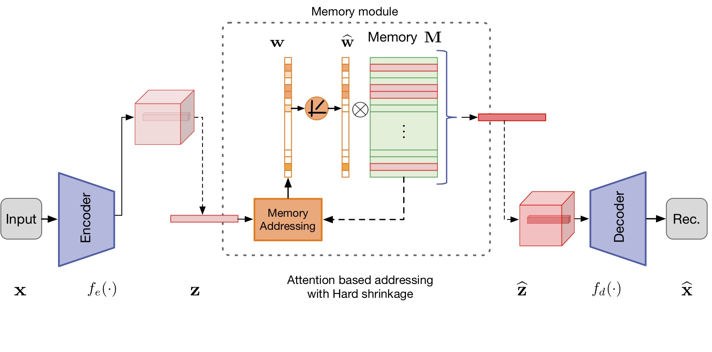

# memae-anomaly-detection

<small>Memorizing Normality to Detect Anomaly: Memory-augmented Deep Autoencoder (MemAE) for Unsupervised Anomaly Detection 

Dong Gong, Lingqiao Liu, Vuong Le, Budhaditya Saha, Moussa Reda Mansour, Svetha Venkatesh, Anton van den Hengel.  
In IEEE International Conference on Computer Vision (ICCV), 2019.
\[[Paper](https://openaccess.thecvf.com/content_ICCV_2019/papers/Gong_Memorizing_Normality_to_Detect_Anomaly_Memory-Augmented_Deep_Autoencoder_for_Unsupervised_ICCV_2019_paper.pdf)\]\[[Project](https://donggong1.github.io/anomdec-memae.html)\]
</small>

 

## Requirements
+ Python 3.6
+ PyTorch 0.4.1 (tested with 0.4.1)
+ torchvision 0.2.1 (tested with 0.2.1)
+ (optional) Tensorflow 1.3.0 (only for logging with tensorboard)
+ MATLAB (for data preparation)

## Usage
### Testing
1. Install this repository and the required packages.
2. Download pretrained models from \[[MODELS](https://drive.google.com/drive/folders/1N2DvmZwCKx_8bZWeueJNn9nsh3rQXdTg?usp=sharing)\]. Move them into `./models`.
3. Prepare dataset.
   1) Download dataset.
   2) Move the dataset into `./dataset`. 
   3) The dataset folder should be organized in specific stuctures to fit the `dataloader` as the followings. This can be obtained by running the corresponding script in `./matlab_script`.
4. Run `.sh` files or `python script_testing.py`. 

### Training
1. Prepare data (as in the above 'Testing' section).
2. Run `train_video_MemAE.sh` file or `python script_training.py`. Before running the script, please set up the paths (for data, model, and results), hyperparameters, and other options defined in `./options/training_options.py`.

## Citation
If you use this code for your research, please cite our paper.

```
@inproceedings{gong2019memorizing,
  title={Memorizing Normality to Detect Anomaly: Memory-augmented Deep Autoencoder for Unsupervised Anomaly Detection},
  author={Gong, Dong and Liu, Lingqiao and Le, Vuong and Saha, Budhaditya and Mansour, Moussa Reda and Venkatesh, Svetha and Hengel, Anton van den},
  booktitle={IEEE International Conference on Computer Vision (ICCV)},
  year={2019}
}
```
